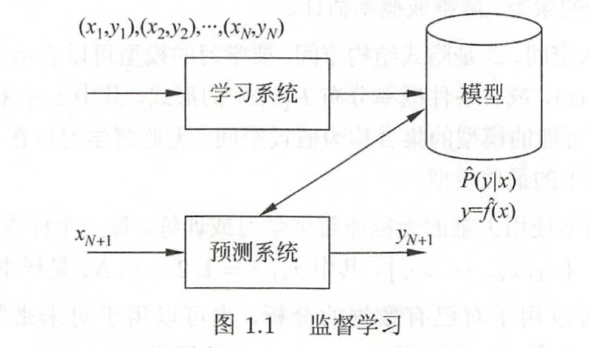

# Basics of ML algorithms
## Definition: 
- ML algorithms build models based on sample data, know as "training data", in order to make predictions or decisions without being explicitly programmed to do so.
## Object:
- Data:

## Aim:
- Consider which model should be learnt and how to learn models to achieve accurate prediction and analysis with highest possible efficiency.

## Process:
{height=20px width=30px}
- 1. Get a limited training set;
- 2. Confirm the hypothesis space (a space including all the possible models);
- 3. Make the learining strategy or the standard to choose a model；
- 4. Use algorithms to solve the optimal model；
- 5. Choose the optimal model；
- 6. Use the model to analyze or predict new data.

## Categories: 
### Supervised

### Unsupervised
### Reinforcement

# Attribute-value pairs
# 
