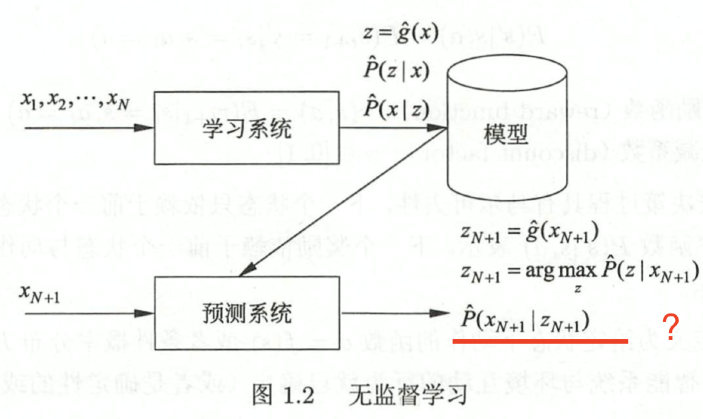
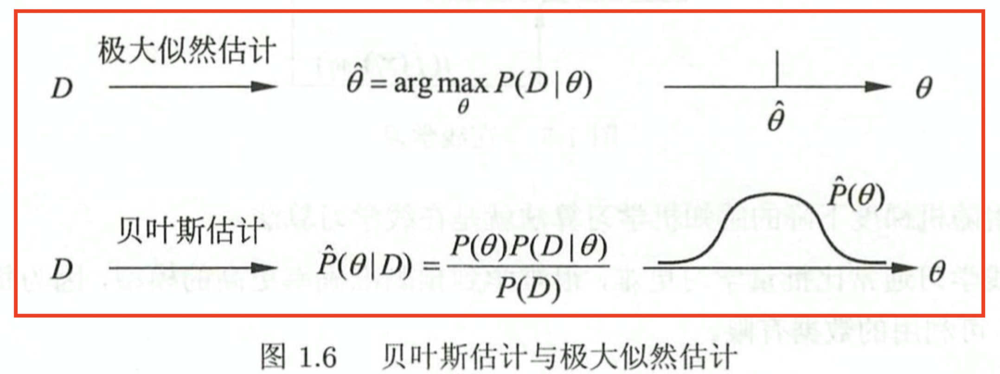

# Basics of ML algorithms
## Definition: 
- ML algorithms build models based on sample data, know as "training data", in order to make predictions or decisions without being explicitly programmed to do so.
## Object:
- Data:

## Aim:
- Consider which model should be learnt and how to learn models to achieve accurate prediction and analysis with highest possible efficiency.

## Process:
{width=250px}
- 1. Get a limited training set;
- 2. Confirm the hypothesis space (a space including all the possible models);
- 3. Make the learining strategy or the standard to choose a model；
- 4. Use algorithms to solve the optimal model；
- 5. Choose the optimal model；
- 6. Use the model to analyze or predict new data.

## Basic Categories: 
### Supervised and Unsupervised model:
#### Supervised
- learning predictive models from labelled data.

, where $y_{N+1} = arg max_{y}\hat{P}(y|x_{N+1})$ or $y_{N+1} = \hat{f}(x_{N+1})$
#### Unsupervised
- learning predictive models from unlabelled data.

- Reinforcement
- Semi-supervised learning
- Active learning

### Probabilistic and deterministic model:
- Main difference is in the inner structure: a probabilistic model can be expressed as joint probability distribution whereas a non-probabilistic model often cannnot. 
- Logistics model can be viewed as both
#### Probabilistic model:
- $P(y|x)$ or $P(z|x)$, $P(x|z)$
- Decision trees; naive bayes; GM
#### Deterministic model:
- $y = f(x)$
- SVM, KNN, AdaBoost, K-means, neural networks

### Parametric and non-parametric model:
- Whether the dimension of a model is fixed and limited
- P: Naive bayes, logistics regression, k-means, gmm
- NP: DT, SVM, AdaBoost, KNN

### Bayesian learning and kernel method:
#### Bayesian learning
- Calculate the probability of a model given certain data or posterior probability. 

#### Kernal method
- Kernel SVM, PCA, and k-means


## Three elements of machine learning
### model
- for supervised learning, model is the conditional probability distribution and decision function
- hypothesis space for decision functions:
$$ F = {f|Y=f_{\theta}(X),\theta in R^{n}} $$
- hypothesis sapce for conditional probability distribution:
$$ F = {P|P(Y|X),\theta in R^{n}} $$
### strategy
- according to what standards to learn or choose the optimal model
#### Loss (cost) function and risk function (expected loss):
- Loss(cost) function:
  - 0-1 loss function
  ```
  $$ L(Y,f(X)) = \begin{cases}
  1, Y!=f(X)\\
  0, Y=f(X)
  \end{cases}$$
  ```
  - quadratic loss function
  - absolute loss function
  - logarithmic loss function
- Risk function:
#### Minimization strategy
- ERM(empirical risk minimization)
- SRM(structural risk minimization)
### algorithm

# Attribute-value pairs
# 
